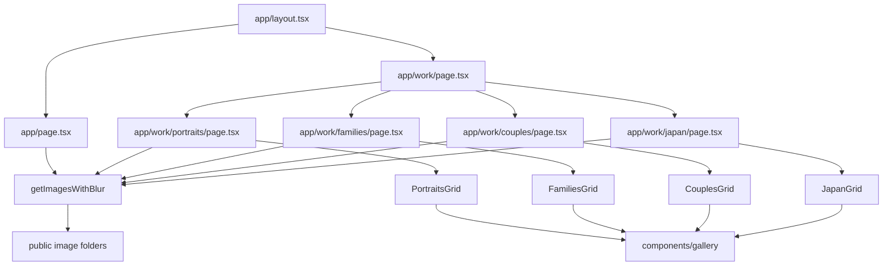

# Blackburn Studio Technical Architecture (Current State)

Last reviewed: 2026-06-27

## Scope

This document records the implemented architecture in this repository only. It excludes external systems not visible in source control.

Primary sources:

- [package.json](../../package.json)
- [package-lock.json](../../package-lock.json)
- [next.config.ts](../../next.config.ts)
- [tsconfig.json](../../tsconfig.json)
- [eslint.config.mjs](../../eslint.config.mjs)
- [postcss.config.mjs](../../postcss.config.mjs)
- [app](../../app)
- [components/gallery](../../components/gallery)
- [lib/getImagesWithBlur.ts](../../lib/getImagesWithBlur.ts)
- [public](../../public)
- [.github/workflows/azure-static-web-apps-zealous-pebble-08f954100.yml](../../.github/workflows/azure-static-web-apps-zealous-pebble-08f954100.yml)

## Framework and version

- Framework: Next.js App Router
- Version: `next 16.2.4`
- Evidence: [package.json](../../package.json)

## Language and runtime

- Language: TypeScript for app code (`.ts`, `.tsx`)
- Client framework: React `19.2.4`
- Server runtime assumptions: Node.js for local build and CI (GitHub Actions ubuntu-latest)
- Evidence: [package.json](../../package.json), [tsconfig.json](../../tsconfig.json), [.github/workflows/azure-static-web-apps-zealous-pebble-08f954100.yml](../../.github/workflows/azure-static-web-apps-zealous-pebble-08f954100.yml)

## Package manager

- Package manager in use: npm (lockfile version 3)
- Evidence: [package-lock.json](../../package-lock.json)

## Repository structure

Top-level functional areas:

- `app`: App Router pages, root layout, global styles
- `components/gallery`: shared gallery and lightbox components
- `lib`: image metadata/blur generation
- `public`: static images, favicons, manifest
- `scripts`: one-shot image compression tooling
- `.github/workflows`: CI/CD deployment workflow
- `docs`: engineering documentation

## Application entry points

- Root layout: [app/layout.tsx](../../app/layout.tsx)
- Home page: [app/page.tsx](../../app/page.tsx)
- Work index: [app/work/page.tsx](../../app/work/page.tsx)
- Category routes: files under [app/work](../../app/work)

## Routing model

- Next.js App Router using file-system routes.
- Public pages are static routes only:
  - `/`
  - `/work`
  - `/work/portraits`
  - `/work/families`
  - `/work/couples`
  - `/work/japan`
- No API routes are present in [app](../../app).

## Layouts

- Single root layout in [app/layout.tsx](../../app/layout.tsx).
- No nested route layouts detected.
- Category pages repeat common chrome in page files rather than consuming a shared header/footer component.

## Major shared components

Gallery subsystem under [components/gallery](../../components/gallery):

- [components/gallery/GalleryImageCard.tsx](../../components/gallery/GalleryImageCard.tsx)
- [components/gallery/lightbox/Lightbox.tsx](../../components/gallery/lightbox/Lightbox.tsx)
- [components/gallery/lightbox/CarouselTrack.tsx](../../components/gallery/lightbox/CarouselTrack.tsx)
- [components/gallery/lightbox/MorphOverlay.tsx](../../components/gallery/lightbox/MorphOverlay.tsx)
- [components/gallery/lightbox/LightboxControls.tsx](../../components/gallery/lightbox/LightboxControls.tsx)
- [components/gallery/lightbox/useLightboxGestures.ts](../../components/gallery/lightbox/useLightboxGestures.ts)
- [components/gallery/lightbox/useScrollLock.ts](../../components/gallery/lightbox/useScrollLock.ts)
- [components/gallery/lightbox/constants.ts](../../components/gallery/lightbox/constants.ts)

## Content and data organisation

- Content copy is embedded in page components.
- Collection image ordering and alt text are defined in route files and data helper arrays:
  - [app/work/couples/page.tsx](../../app/work/couples/page.tsx)
  - [app/work/families/page.tsx](../../app/work/families/page.tsx)
  - [app/work/japan/page.tsx](../../app/work/japan/page.tsx)
  - [lib/getImagesWithBlur.ts](../../lib/getImagesWithBlur.ts) for default portrait sources
- There is no CMS, JSON content file, or external content API.

## Photography collection data model

Model shape (from [components/gallery/types.ts](../../components/gallery/types.ts)):

- `id: number`
- `src: string`
- `alt: string`
- `blurDataURL: string`
- `width?: number`
- `height?: number`
- `orientation?: "portrait" | "landscape" | "square"`

Build-time enrichment in [lib/getImagesWithBlur.ts](../../lib/getImagesWithBlur.ts):

- Reads image bytes from local `public/<folder>`
- Generates blur placeholder via `plaiceholder`
- Derives orientation from width/height metadata

## Gallery implementation

- Each category has a route-level grid component (`CouplesGrid`, `FamiliesGrid`, `JapanGrid`, `PortraitsGrid`).
- Grid components share the same open/close state machine and reusable lightbox component.
- Editorial sequencing is hard-coded in component JSX and source arrays.
- Evidence: [app/work/portraits/PortraitsGrid.tsx](../../app/work/portraits/PortraitsGrid.tsx), [app/work/couples/CouplesGrid.tsx](../../app/work/couples/CouplesGrid.tsx), [app/work/families/FamiliesGrid.tsx](../../app/work/families/FamiliesGrid.tsx), [app/work/japan/JapanGrid.tsx](../../app/work/japan/JapanGrid.tsx)

## Lightbox implementation

- Custom lightbox implementation (no third-party lightbox package).
- Supports:
  - Keyboard navigation (`Escape`, `ArrowLeft`, `ArrowRight`)
  - Touch gestures with axis lock and velocity thresholds
  - Morph overlay open/close transitions
  - Scroll lock while dialog is open
- Evidence: files under [components/gallery/lightbox](../../components/gallery/lightbox)

## Image source locations

Observed folders in [public](../../public):

- [public/images](../../public/images)
- [public/couples](../../public/couples)
- [public/families](../../public/families)
- [public/japan](../../public/japan)
- [public/Portraits](../../public/Portraits)

Important implementation detail:

- Default portrait loader folder is `portraits` (lowercase) in [lib/getImagesWithBlur.ts](../../lib/getImagesWithBlur.ts).
- Compression script also targets `public/portraits` in [scripts/compress-images.mjs](../../scripts/compress-images.mjs).
- On-disk folder is `public/Portraits` in this working tree.

Known risk:

- Folder-case mismatch may create Linux/CI sensitivity and requires verification in target deployment environment.

## Image loading and optimisation

- Uses Next Image in UI components.
- Global Next config disables runtime image optimisation:
  - `images.unoptimized: true`
  - Evidence: [next.config.ts](../../next.config.ts)
- Build-time blur placeholders generated through `plaiceholder` + `sharp` in [lib/getImagesWithBlur.ts](../../lib/getImagesWithBlur.ts).
- Additional manual compression script exists at [scripts/compress-images.mjs](../../scripts/compress-images.mjs).

## RAW-only or image-selection filtering

- No RAW-only filtering or EXIF-based filtering found.
- Selection is manual through hard-coded source arrays and JSX ordering.

## Styling approach

- Tailwind CSS v4 via PostCSS plugin.
- Global styles and keyframes in [app/globals.css](../../app/globals.css).
- Utility-first classes embedded in components/pages.

## Design tokens

Defined custom tokens in [app/globals.css](../../app/globals.css):

- `--background: #0a0a0a`
- `--foreground: #f4f4f5`
- Theme mapping through `@theme inline` for foreground/background and font variables.

## Typography and font loading

- Uses `Geist` and `Geist_Mono` from `next/font/google` in [app/layout.tsx](../../app/layout.tsx).
- Base font stack in [app/globals.css](../../app/globals.css) includes system fallbacks.

## Metadata and SEO

- Global metadata defined in [app/layout.tsx](../../app/layout.tsx): title, description, icons, manifest.
- Route-level metadata present on work routes (title for all categories; description only on `/work` and `/work/japan`).
- No Open Graph or Twitter metadata objects found.
- No explicit canonical URLs found.

## Sitemap, robots and manifest configuration

- Manifest configured as `/site.webmanifest` via [app/layout.tsx](../../app/layout.tsx).
- Manifest file: [public/site.webmanifest](../../public/site.webmanifest).
- No `robots.ts`, `robots.txt`, `sitemap.ts`, or `sitemap.xml` found in repository.

## Contact implementation

- Single mailto link: `hello@theblackburn.studio` in [app/page.tsx](../../app/page.tsx).
- No backend mail endpoint or form handler.

## Analytics and telemetry

- No analytics or telemetry integration found in application source.
- Note: telemetry-related transitive packages in lockfile are dependency internals, not direct site instrumentation.

## Tests

- No test files or test script in [package.json](../../package.json).
- Current scripts: `dev`, `build`, `start`, `lint`.

## Linting and formatting

- ESLint configured in [eslint.config.mjs](../../eslint.config.mjs).
- `npm run lint` available.
- No dedicated formatter config (for example Prettier config) detected.

## Build commands

Defined in [package.json](../../package.json):

- `npm run dev`
- `npm run build`
- `npm run start`
- `npm run lint`

## Deployment workflows

- GitHub Actions workflow for Azure Static Web Apps:
  - [.github/workflows/azure-static-web-apps-zealous-pebble-08f954100.yml](../../.github/workflows/azure-static-web-apps-zealous-pebble-08f954100.yml)
- Triggered on push to `main` and pull request events.
- Uses `Azure/static-web-apps-deploy@v1` action.
- Build output configured as `out` with `is_static_export: true`.

## Azure Static Web Apps configuration

Visible configuration:

- CI workflow file above.
- Next static export config in [next.config.ts](../../next.config.ts) aligns with SWA static deployment.

Not found:

- No `staticwebapp.config.json` in repository.

## Domain-related configuration visible in repository

Visible:

- Email domain usage: `theblackburn.studio` via mailto link.

Requires verification:

- Primary website domain and any custom-domain mapping in Azure.

## Environment variables

Observed in source:

- `NEXT_PUBLIC_IMAGE_BASE_URL` in [app/page.tsx](../../app/page.tsx) and [app/work/page.tsx](../../app/work/page.tsx)
- Fallback default is `/images` when env var is unset.

No `.env` files are committed in repository.

## Security-relevant configuration

Verified:

- Static export architecture reduces server-side runtime surface.
- Deployment token is stored in GitHub Secrets in workflow (secret name referenced, value not present in repo).

Requires verification:

- Runtime security headers and WAF/CDN settings are not visible here.
- Azure access control and branch protection policies are external to repository.

## Accessibility-related implementation

Verified implementation patterns:

- Semantic headings and sectioning in page files.
- Focus-visible styles on interactive elements.
- Lightbox has `role="dialog"` and `aria-modal="true"`.
- Reduced-motion CSS branches in [app/globals.css](../../app/globals.css) and reduced-motion handling in lightbox hooks.

Known gap:

- No explicit focus trap implementation in lightbox component.

## Known technical debt

- Repeated header/footer/navigation markup across multiple pages.
- No automated test coverage.
- No robots/sitemap implementation.
- Metadata implementation is uneven across routes.
- Potential folder-case mismatch (`Portraits` vs `portraits`) should be validated in Linux build/deploy contexts.
- Existing gallery documents in [docs](../../docs) include historical statements that no longer match current route implementation and need periodic reconciliation.

## Areas requiring external verification

- Production domain and DNS setup.
- Azure Static Web Apps runtime settings outside repository.
- Actual build/deploy outcomes in cloud environment.
- Any analytics or telemetry implemented outside this codebase.

## Diagram: high-level application structure



## Diagram: route and layout relationships

```mermaid
flowchart TD
  Root[/app/layout.tsx\nRoot layout/] --> Home[/]
  Root --> Work[/work]
  Root --> Portraits[/work/portraits]
  Root --> Families[/work/families]
  Root --> Couples[/work/couples]
  Root --> Japan[/work/japan]

  Home -->|nav| Work
  Work --> Portraits
  Work --> Families
  Work --> Couples
  Work --> Japan
```

## Diagram: photography content flow

```mermaid
flowchart LR
  A[Category source arrays\nalt + file + id] --> B[getImagesWithBlur]
  C[public/<folder>/*.jpg] --> B
  B --> D[GalleryImage[]\n+ blurDataURL + dimensions]
  D --> E[Category Grid component]
  E --> F[GalleryImageCard]
  F --> G[Lightbox]
  G --> H[CarouselTrack + MorphOverlay]
```
